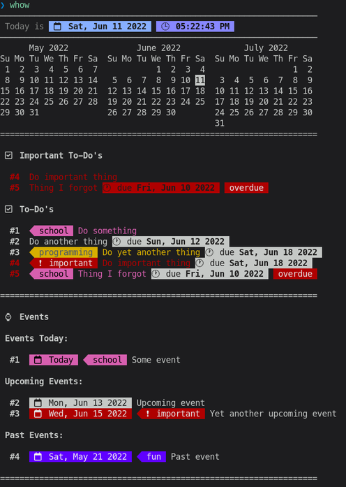
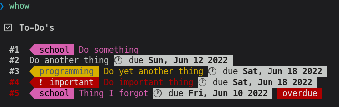
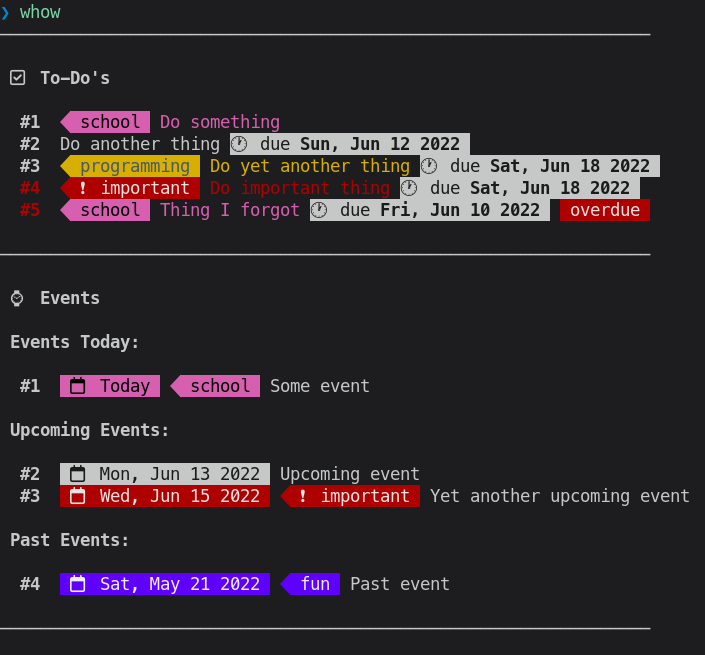

# Whow

Whow - when, how?





Whow is a to-do and event manager. It can parse your `todo` and `events` plain text files and render it to a human-readable, colorful, simple, and customizable display. To interact with it, you can edit the `todos` and `events` text files directly, or use it as a CLI front-end.

Whow has similar concepts to [todo.txt](https://github.com/todotxt/todo.txt-cli) (and no, I didn't even know it existed back when I started writing it).

# Installation

Clone this repository and move `whow` somewhere to your `PATH`:

```bash
git clone https://github.com/DaringCuteSeal/whow.git
mv whow ~/.local/bin
```

Or get it directly:

```bash
curl -o ~/.local/bin/whow https://raw.githubusercontent.com/DaringCuteSeal/whow/main/whow
```

If you're on Arch Linux, you can clone this repository, `cd` to `makepkg`, and type `makepkg -si`. Or `curl` the PKGBUILD. Do it however you want :/

# Overview

`whow` exists as a command. Without any arguments passed, it will print out blocks of sections defined on the configuration file.

To-do's and events files are stored in a cache directory, again, defined on the configuration file. It is named `todos` and `events`, respectively. The two files will be sourced by `whow` which can then display it in a more friendly way.


# Getting Started

## Configuration

Copy the `rc` file located at the `config/` directory to `$XDG_CONFIG_DIR/whow` or `$HOME/.config/whow` and edit it. It's already pretty well documented, so change whatever you need.

For experimenting around, you can also copy the example `todos` and `events` file to the cache directory defined on the configuration file (default is `$HOME/.config/whow/`).

## Displaying

Run `whow show` to display sections on your configuration file. `whow show todos` will only display your to-do's, and `whow show events` will only display your events. `whow show important` will show you important to-do's and events for today.

## Adding, Marking, and Deleting To-do's

To add a new to-do, run `whow todo add <name> [due] [@category]`.
Mark done/undone your to-do by running `whow todo mark <index>`, where index is the number shown before a to-do.
Lastly, delete your to-do by running `whow todo del <index>`.

## Adding and Deleting Events

Add a new event by running `whow event add <date> <name> [@category]` and delete it by running `whow event del <index>`.


# Syntax

## To-Do's

You can add to-do's by calling the `todo` command. They should be placed on your `todos` file.

The syntax consists of the following:

```
todo <name> [due] [@category] [v]
```

..with the name being required, and optionally a due date and a category name that starts with @. `v` marks the to-do as done.

- The due date uses the date format defined on the configuration file—either or mm/dd/yyyy dd/mm/yyyy. It can optionally include time, and you can include it by separating the date and the time with a caret (`^`) (e.g `03/03/2022^1 PM`, `03/03/2022^1`, or `03/03/2022^05:30 PM`).
- You can only use category that has been defined on the configuration file.

Examples:

```bash
todo "Record some footage for motion tracking"
todo "Finish writing Whow" @programming
todo "Write an article about privacy" "07/26/2022^10:00 PM"
```

## Events

You can add events by calling the `event` command. They should be placed on your `events` file.

The syntax consists of the following:
```
event <date> <name> [@category]
```

..with the date and name being required, and optionally a category name that starts with @.

- The due date uses the date format defined on the configuration file—either or mm/dd/yyyy dd/mm/yyyy.

Examples:

```bash
event "03/21/2022" "Go to Someone's party" @fun
event "03/23/2022" "Visit some of my friends at Jakarta"
event "03/25/2022" "Go buy a new pair of sneakers" 
```

# To-Do's (How Ironic)

- [x] Implement a new way to check for "today", because if user uses a date format that's not unique it's gonna be problematic.
- [x] Fix important section and the way of checking if a to-do is overdue.
- [x] Convert input to-do date to a proper format
- [ ] Fix the absolutely slow dd/mm/yyyy support
